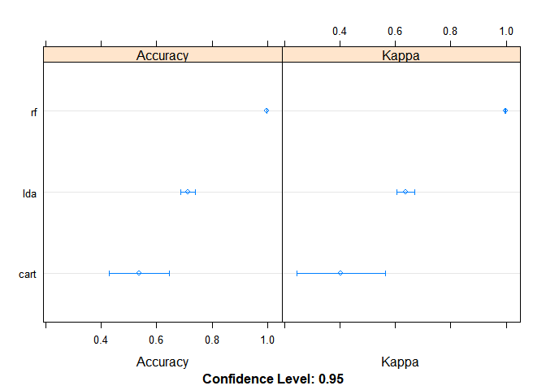

Summary
-------

Six participants were asked to perform barbell lifts correctly and
incorrectly in 5 different ways. The goal of this project is to predict
the manner in which these participants did the exercise. To achieve this
goal, we developed three predictive models and compared their accuracy
on the training data set. 54 numeric variables (features) were used to
train the models. The best model (random forest) was used for final
predictions on the testing data set and correctly classified all 20 test
cases.

Data cleaning and feature selection
===================================

The data for this project come from this source:
<http://groupware.les.inf.puc-rio.br/har>.

    library(caret)

    ## Warning: package 'caret' was built under R version 3.4.4

    ## Loading required package: lattice

    ## Loading required package: ggplot2

    #loading data
    training_all = read.csv("pml-training.csv")
    testing = read.csv("pml-testing.csv")

    #exploratory analysis
      #names(training_all)
      #summary(training_all)
    table(training_all$classe)

    ## 
    ##    A    B    C    D    E 
    ## 5580 3797 3422 3216 3607

    #removing variables where over 30% is missing
    training <- training_all[colSums(is.na(training_all))/nrow(training_all) < .3]

    #removing all factor variables, row numbers and timestamps
    classe_vector <- training$classe
    nums <- unlist(lapply(training, is.numeric))  
    training <- training[ , nums]
    training <- training[ , colnames(training)!="X"]
    training <- training[ , colnames(training)!="raw_timestamp_part_1"]
    training <- training[ , colnames(training)!="raw_timestamp_part_2"]

    #adding classe back
    training$classe <- classe_vector

Chosing a prediction algorythm
==============================

We tried three predictive algorythms: Random Forest (RF), Linear
Discriminant Analysis (LDA) and Classification and Regression Trees
(CART).

    # Run algorithms using 3-fold cross validation
    control <- trainControl(method="cv", number=3)
    metric <- "Accuracy"
    ##Random Forest (RF)
    set.seed(7)
    fit.rf <- train(classe~., data=training, method="rf", na.action = na.pass, metric=metric, trControl=control)
    ##Linear Discriminant Analysis (LDA)
    set.seed(7)
    fit.lda <- train(classe~., data=training, method="lda", metric=metric, trControl=control)
    ##Classification and Regression Trees (CART).
    set.seed(7)
    fit.cart <- train(classe~., data=training, method="rpart", metric=metric, trControl=control)

Accuracy of predictive models
-----------------------------

Random forest had the best accuracy.

    ##summarize accuracy of models
    results <- resamples(list(lda=fit.lda, rf=fit.rf, cart=fit.cart))
    summary(results)

    ## 
    ## Call:
    ## summary.resamples(object = results)
    ## 
    ## Models: lda, rf, cart 
    ## Number of resamples: 3 
    ## 
    ## Accuracy 
    ##           Min.   1st Qu.    Median      Mean   3rd Qu.      Max. NA's
    ## lda  0.7020333 0.7091423 0.7162513 0.7134853 0.7192113 0.7221713    0
    ## rf   0.9974010 0.9975537 0.9977064 0.9978595 0.9980888 0.9984712    0
    ## cart 0.4887632 0.5185406 0.5483180 0.5373056 0.5615768 0.5748357    0
    ## 
    ## Kappa 
    ##           Min.   1st Qu.    Median      Mean   3rd Qu.      Max. NA's
    ## lda  0.6227560 0.6318499 0.6409438 0.6374406 0.6447829 0.6486221    0
    ## rf   0.9967126 0.9969057 0.9970989 0.9972926 0.9975825 0.9980662    0
    ## cart 0.3315140 0.3761754 0.4208368 0.4030485 0.4388157 0.4567946    0

    # compare accuracy of models
    dotplot(results)

Classifying the test cases
==========================

Random forest showed the best accuracy, so we used it for predicting
test values.

    #predictions <- predict(fit.lda, testing)
    predictions <- predict(fit.rf, testing)
    #predictions <- predict(fit.cart, testing)
    predictions

    ##  [1] B A B A A E D B A A B C B A E E A B B B
    ## Levels: A B C D E
