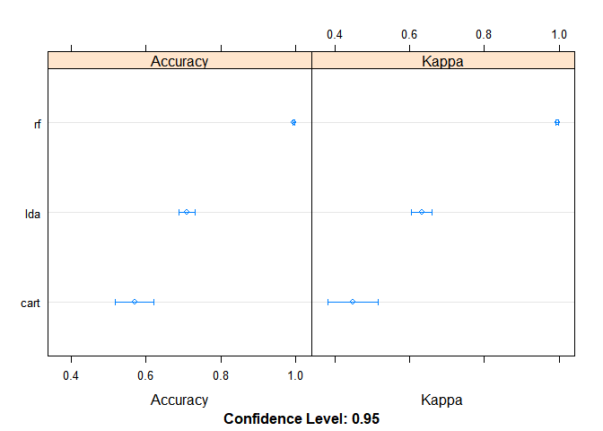

## Summary

Six participants were asked to perform barbell lifts correctly and incorrectly in 5 different ways. The goal of this project is to predict the manner in which these participants did the exercise. To achieve this goal, we developed three predictive models and compared their accuracy on the training data set. 54 numeric variables (features) were used to train the models. The best model (random forest) was used for final predictions on the testing data set and correctly classified all 20 test cases.


#Data Cleaning and Feature Selection

The data for this project come from this source: http://groupware.les.inf.puc-rio.br/har. 

We removed all factor variables, row numbers and timestamps. After that there remained 54 numeric variables.
We saved 30% of the dataset to test out of sample error.


```r
library(caret)
```

```
## Warning: package 'caret' was built under R version 3.4.4
```

```
## Loading required package: lattice
```

```
## Loading required package: ggplot2
```

```r
#loading data
training_all = read.csv("pml-training.csv")
testing = read.csv("pml-testing.csv")

#exploratory analysis
  #names(training_all)
  #summary(training_all)
table(training_all$classe)
```

```
## 
##    A    B    C    D    E 
## 5580 3797 3422 3216 3607
```

```r
#removing variables where over 30% is missing
training_all <- training_all[colSums(is.na(training_all))/nrow(training_all) < .3]

#removing all factor variables, row numbers and timestamps
classe_vector <- training_all$classe
nums <- unlist(lapply(training_all, is.numeric))  
training_all <- training_all[ , nums]
training_all <- training_all[ , colnames(training_all)!="X"]
training_all <- training_all[ , colnames(training_all)!="raw_timestamp_part_1"]
training_all <- training_all[ , colnames(training_all)!="raw_timestamp_part_2"]

#adding classe back
training_all$classe <- classe_vector

#data partitioning
inTrain = createDataPartition(training_all$classe, p = 0.7)[[1]]
training = training_all[ inTrain,]
validation = training_all[-inTrain,]
```

#Running Three Different Algorythms

We tried three predictive algorythms: Random Forest (RF), Linear Discriminant Analysis (LDA) and Classification and Regression Trees (CART). For each algorythm we used 54 available numeric variables (features). The algorythms were run with 3-fold cross validation to check the accuracy. Models we trained using caret package.


```r
# Run algorithms using 3-fold cross validation
control <- trainControl(method="cv", number=3)
metric <- "Accuracy"
##Random Forest (RF)
set.seed(7)
fit.rf <- train(classe~., data=training, method="rf", na.action = na.pass, metric=metric, trControl=control)
##Linear Discriminant Analysis (LDA)
set.seed(7)
fit.lda <- train(classe~., data=training, method="lda", metric=metric, trControl=control)
##Classification and Regression Trees (CART).
set.seed(7)
fit.cart <- train(classe~., data=training, method="rpart", metric=metric, trControl=control)
```

#Accuracy of Predictive Models Estimated by the Cross Validation

Random forest had the best accuracy.


```r
##summarize accuracy of models
results <- resamples(list(lda=fit.lda, rf=fit.rf, cart=fit.cart))
summary(results)
```

```
## 
## Call:
## summary.resamples(object = results)
## 
## Models: lda, rf, cart 
## Number of resamples: 3 
## 
## Accuracy 
##           Min.   1st Qu.    Median      Mean   3rd Qu.      Max. NA's
## lda  0.7034287 0.7043344 0.7052402 0.7093990 0.7123842 0.7195282    0
## rf   0.9954138 0.9957419 0.9960699 0.9964331 0.9969428 0.9978156    0
## cart 0.5496833 0.5592303 0.5687773 0.5698495 0.5799326 0.5910878    0
## 
## Kappa 
##           Min.   1st Qu.    Median      Mean   3rd Qu.      Max. NA's
## lda  0.6247435 0.6257164 0.6266894 0.6321810 0.6358998 0.6451101    0
## rf   0.9941990 0.9946138 0.9950286 0.9954883 0.9961329 0.9972371    0
## cart 0.4225804 0.4330213 0.4434622 0.4476817 0.4602323 0.4770024    0
```

```r
# compare accuracy of models
dotplot(results)
```

<!-- -->

#Out of Sample Error

We estimated accuracy of the RF model on the validation dataset. 

```r
validation_predictions <- predict(fit.rf, validation)
confusionMatrix(validation_predictions, validation$classe)
```

```
## Confusion Matrix and Statistics
## 
##           Reference
## Prediction    A    B    C    D    E
##          A 1673    4    0    0    0
##          B    0 1128    2    0    0
##          C    0    7 1024    5    0
##          D    0    0    0  958    3
##          E    1    0    0    1 1079
## 
## Overall Statistics
##                                           
##                Accuracy : 0.9961          
##                  95% CI : (0.9941, 0.9975)
##     No Information Rate : 0.2845          
##     P-Value [Acc > NIR] : < 2.2e-16       
##                                           
##                   Kappa : 0.9951          
##  Mcnemar's Test P-Value : NA              
## 
## Statistics by Class:
## 
##                      Class: A Class: B Class: C Class: D Class: E
## Sensitivity            0.9994   0.9903   0.9981   0.9938   0.9972
## Specificity            0.9991   0.9996   0.9975   0.9994   0.9996
## Pos Pred Value         0.9976   0.9982   0.9884   0.9969   0.9981
## Neg Pred Value         0.9998   0.9977   0.9996   0.9988   0.9994
## Prevalence             0.2845   0.1935   0.1743   0.1638   0.1839
## Detection Rate         0.2843   0.1917   0.1740   0.1628   0.1833
## Detection Prevalence   0.2850   0.1920   0.1760   0.1633   0.1837
## Balanced Accuracy      0.9992   0.9950   0.9978   0.9966   0.9984
```

#Classifying 20 Test Cases

Random forest showed the best accuracy, so we applied it for predicting test values. All predictions were correct.


```r
#predictions <- predict(fit.lda, testing)
predictions <- predict(fit.rf, testing)
#predictions <- predict(fit.cart, testing)
predictions
```

```
##  [1] B A B A A E D B A A B C B A E E A B B B
## Levels: A B C D E
```


